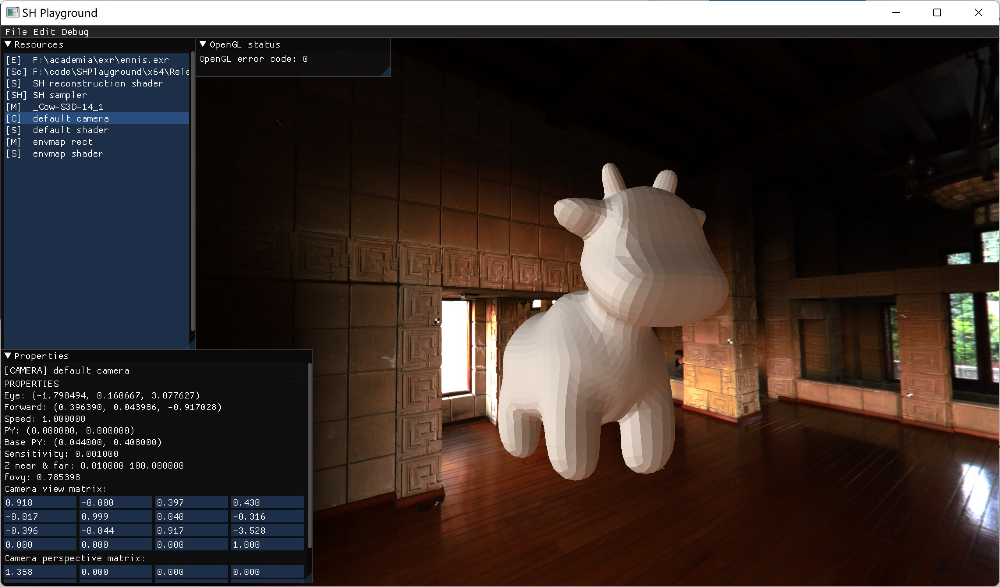

## SHPlayground

An application which (partially) implements [\[Sloan 2002\]](https://jankautz.com/publications/prtSIG02.pdf) with CUDA acceleration. Radiance self-transfer without interreflection.

Interreflection is also theoretically doable, however I have not implemented BVH and that is extremely slow and janky, so I decided to simply remove it. 

## Usage

You can load .obj/COLLADA scenes into the application and visualize them. For a scene to visualize, you will need:

- A selected model
- A selected shader
- A camera

https://user-images.githubusercontent.com/4988733/173726051-91c4545b-4893-49a4-ba7d-45cad320912d.mp4

You can evaluate and visualize envmap coefficient by using SH sampler. Don't forget to reconfigure after you change the SH texture size.

https://user-images.githubusercontent.com/4988733/173726066-4fddcf8c-8927-4568-82c0-4aa239f4f153.mp4

You can evaluate scene coefficient per-vertex and use SH reconstruction shader to visualize. Note that the shader I written only supports `l=4` expansion, which means 16 coefficients per-vertex (I have no idea how to pass more than that to shader.)

https://user-images.githubusercontent.com/4988733/173726137-6ffccafd-109c-4349-9676-8f29f3acad96.mp4

## Dependencies

Since I used Visual Studio and not CMake, dependencies in the project will be all wrong (absolute paths) and you'll have to fix them (sorry!). Here's a list of dependencies:

- CUDA v11.7
- [tinyexr](https://github.com/syoyo/tinyexr) and its dependency [miniz](https://github.com/syoyo/tinyexr/tree/master/deps/miniz)
- [Assimp](https://github.com/assimp/assimp) 5.2.4
- [Dear ImGui](https://github.com/ocornut/imgui) 1.87
- [ImGuiFileDialog](https://github.com/aiekick/ImGuiFileDialog) 0.6.4
- [GLFW](https://github.com/glfw/glfw) 3.3.7
- [glm](https://github.com/g-truc/glm)
